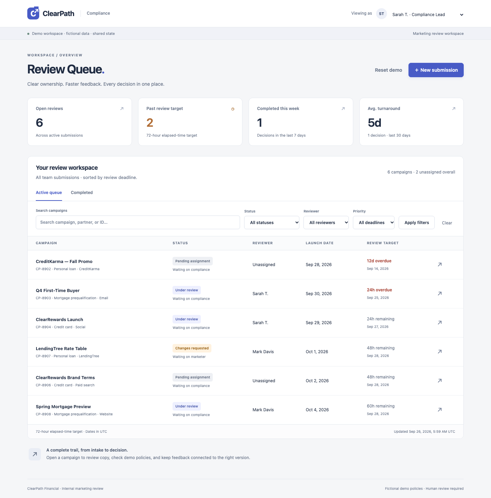

# ClearPath Compliance Review

A working marketing review workspace for fictional ClearPath Financial. It replaces spreadsheet status tracking and disconnected email feedback with structured intake, assigned reviews, versioned copy, and a decision trail.

**[Live demo](https://clearpath-compliance.onrender.com) · [GitHub repository](https://github.com/crescit/clementine)**

**Temp demo DB · seeded like prod.** The persona selector is intentional demo impersonation, not authentication. Policies and campaigns are synthetic.



## Semantic review

The reviewer can go beyond literal copy checks: an optional OpenAI-compatible
model analyzes submission copy and surfaces findings a regex misses, while the
deterministic CLAIM_* scanner still runs underneath. A flagged finding shows a
disposition form (Acknowledge/Dismiss); acknowledging opens the approval gate.
On a live 37-case evaluation the hybrid reviewer raised recall on both splits
(dev 0.385 → 0.692, heldout 0.462 → 0.615) at unchanged precision 1.000 — 17
true positives, 0 false positives across all compliant copy. See
[Live evaluation](docs/EVALUATION.md) and [Verification](docs/VERIFICATION.md).

**Enable it.** Set `CLEARPATH_SEMANTIC_MODE=true` and the
`CLEARPATH_INFERENCE_BASE_URL`, `CLEARPATH_INFERENCE_MODEL`, and
`CLEARPATH_INFERENCE_API_KEY` vars (plus `CLEARPATH_INFERENCE_TIMEOUT_S=150`).
Put the API key only in your private `.env` or the host's secret store — never
in `render.yaml` or `.env.example`. The endpoint must be an OpenAI-compatible
chat API the app can reach.

**Two-minute demo.** 1) Open the policies page as Sarah T. 2) Open CP-8903
(a semantic-only violation) and press **Analyze** — it returns a CLAIM_002
finding. 3) Acknowledge the finding to open **Approve** and approve the
revision. 4) Open CP-8908 as Mark Davis and **Analyze** — it stays **Compliant**,
no semantic findings. Screenshots under `docs/screenshots/semantic-*.png`.

## Deploy on a free host

The repository includes a **Render Blueprint**. Push the project to your GitHub repository, then in Render choose **New → Blueprint**, connect that repository, and deploy. `render.yaml` selects the free Docker web service, configures the database path, and sets the health check. No API keys, frontend build, or separate database service are needed.

**Free-host tradeoff:** Render sleeps idle free services and discards local files on sleep/restart/redeploy. The app automatically seeds a fresh demo workspace; visitor changes do not survive those events. For a persistent free presentation, run Docker Compose locally and share it through ngrok while your computer remains awake. Details and post-deploy checks are in [Deployment](docs/DEPLOYMENT.md).

## Run locally

Requires Python 3.12+ and [uv](https://docs.astral.sh/uv/):

```bash
uv sync --frozen
uv run pytest
uv run uvicorn clearpath.api:app --reload
```

Open http://localhost:8000. The first launch creates and seeds `data/clearpath.db`; subsequent launches preserve work.

Or use Docker:

```bash
docker compose up --build -d
```

Compose stores the database on a named volume. Use **Reset demo** as a reviewer to restore the baseline. `.env.example` documents configuration; export variables for local execution because `.env` is not loaded automatically.

## Five-minute walkthrough

1. Start as **Sarah T.** The baseline has six open campaigns, two past target, and two unassigned. Open **ClearRewards Launch (CP-8904)**.
2. Inspect the highlighted approval claim and missing disclosure. Approval is blocked. Enter feedback and select **Request changes**.
3. Switch to **Jessica Lin** on the same record. Paste this corrected copy into the revision form:

   > You may be pre-qualified for ClearRewards. Explore rewards for everyday purchases. Subject to credit approval.

4. Submit the revision. Version 2 returns directly to Sarah, retaining the original deadline. Select Version 1 to see the original copy and its findings.
5. Switch to **Sarah**, select Version 2, and **Approve version**. The campaign moves to Completed, the decision records the actor/version/time, and queue metrics update.
6. As Jessica, submit an affiliate campaign to see automatic assignment. Include both `Subject to credit approval.` and `ClearPath may compensate this partner.` for a personal loan or credit card. Mortgage copy instead needs `Prequalification is not a commitment to lend.` plus the partner disclosure.

Mark and Sarah share reviewer permissions, but only the assigned reviewer can decide. Reassignment requires a reason. Jessica creates and revises her own submissions.

## Why this addresses the bottleneck

| Coordination cost | Product behavior |
|---|---|
| Review starts with missing information | Required product, channel, launch date, full copy, and affiliate partner |
| Requests sit without an owner | Least-loaded reviewer assignment; explicit reassignment |
| Reviewers cannot identify urgent work | Deadline-ranked queue, ownership/status/search/risk filters |
| Repeated manual checking | Explainable checks on pasted copy; server-enforced approval gate |
| Feedback gets detached from revisions | Immutable versions with version-linked decisions and comments |
| Marketers chase status through email | Visible status, next owner, and revision form on the same record |
| Team cannot see flow | Database-derived open, breached, unassigned, completed, and turnaround metrics |

This is a testable throughput hypothesis, not evidence of measured improvement. [Product decisions](docs/PRODUCT_DECISIONS.md) explains assumptions, rollout measures, and tradeoffs.

## Verification and scope

`uv run pytest` exercises API integration, permissions, state transitions, policy rules, metric boundaries, rollback, and concurrent decisions. A repeatable real-browser acceptance script is in `scripts/browser_check.py`; run it **only against a disposable demo database** because it resets shared state. See [Verification](docs/VERIFICATION.md) for executed checks and screenshots.

FastAPI + SQLite + plain HTML/CSS/browser-native JavaScript. No npm, frontend compilation, external AI calls, or credentials. One server process/worker. Reviewed artifacts are pasted text; links are context only. Excel/email describe the original process, not required imported inputs. Real email, file import, production identity, jurisdictional legal coverage, and automated legal approval are outside this take-home.

[Deployment](docs/DEPLOYMENT.md) · [Architecture](docs/ARCHITECTURE.md) · [Presentation notes](docs/PRESENTATION.md)

## Scale testing and performance handoff

The existing app has been benchmarked with **1k, 10k, and 100k synthetic submissions**, concurrent HTTP traffic, workflow writes, and browser network emulation. Queue pagination and SQL metric aggregation are implemented, with before/after evidence. Metrics at 100k and deep pages remain documented limits; these are local synthetic tests, not production-capacity guarantees. See [Performance results and remaining limits](docs/PERFORMANCE.md) and [reproducible test commands](scripts/performance/README.md).
